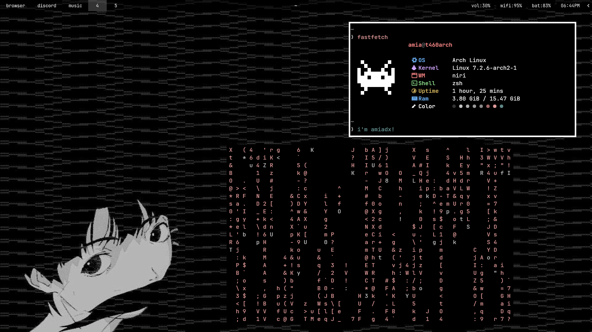

# thinkpad dotfiles
current dotfiles for my t460

## showcase


## quick start
this example will be for arch, but should be easy to apply to anything else.
install paru/yay if you haven't already:

```bash
sudo pacman -S --needed git

git clone https://github.com/amiadx/thinkpad-dotfiles.git
cd thinkpad-dotfiles

paru -S --needed - < packages.txt

stow -t ~ .

sudo systemctl enable ly@tty1.service
sudo systemctl disable getty@tty1.service
```

## description
hello! these are my current dotfiles that i use for my t460.

my t460 has a:
- intel core i5-6300u
- intel hd graphics 520
- upgraded ddr3l 1600mhz 16gb (2x8gb)
- upgraded 256gb ssd
- upgraded intel ax210 wifi card
- upgraded external 6-cell battery
- replaced internal 3-cell battery
- 1920x1080 ips matte panel

the main things in this rice is:
- niri (wm)
- ly (minimal dm)
- waybar (status bar)
- rofi (app opener)
- hyprlock (lockscreen)

## packages used
i'm not going to include basic system utilities as most systems already have it installed.
packages:
- concord (discord tui)
- fastfetch (neofetch but faster)
- helium browser (privacy focused chromium fork)
- hyprlock (customizable lockscreen)
- kitty (terminal emulator)
- ly (minimal tui display manager)
- micro (google docs like simple text editor)
- niri (scrolling wm)
- rofi (app opener)
- soteria (polkit)
- spotatui (spotify tui)
- starship (lightweight prompt)
- stow (dotfiles manager)
- swaybg (lightweight wallpaper)
- swayidle (idle / sleep detector)
- thefuck (command corrector)
- thunar (gui file manager)
- jetbrains mono + nerd font (font of choice)
- waybar (status bar)
- zoxide (smarter cd)
- zsh (shell)
- zsh-autosuggestions (zsh plugin, history based suggestions)
- zsh-syntax-highlighting (zsh plugin, syntax highlighting)

## credits
- waybar config based off of [kamlendras's config](https://github.com/kamlendras/waybar-macos-sequoia/tree/259ecb4b5a65a52ece0708fb4c65db4f57268329)
- fastfetch config is [meetthehorizon's config](https://github.com/fastfetch-cli/fastfetch/discussions/971#discussioncomment-17703671)
